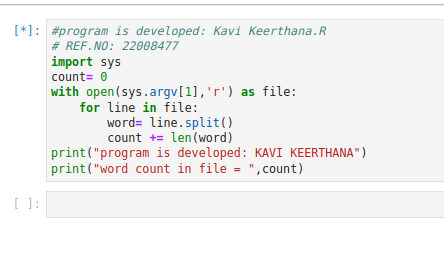
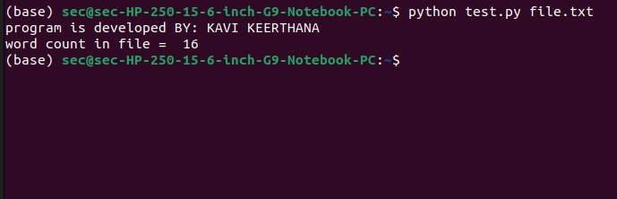

# command-line-arguments-to-count-word
## AIM:
To write a python program for getting the word count from the contents of a file using command line arguments.
## EQUIPEMENT'S REQUIRED: 
PC
Anaconda - Python 3.7
## ALGORITHM: 

### Step 1:
import numpy as np

### Step 2: 
Enter the correct input values
 
### Step 3: 
write a python program for getting the word count from the contents of a file using command line arguments.

### Step 4:
Use command line srguments  

### Step 5: 

End the program

## PROGRAM:
```python
#program is developed: Kavi Keerthana.R
# REF.NO: 22008477
import sys
count= 0
with open(sys.argv[1],'r') as file:
    for line in file:
        word= line.split()
        count += len(word)
print("program is developed: KAVI KEERTHANA")
print("word count in file = ",count)
```

### OUTPUT:




## RESULT:
Thus the program is written to find the word count from the contents of a file using command line arguments.
